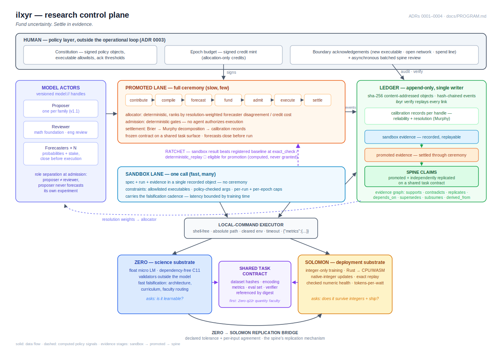
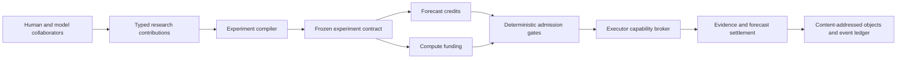

# Architecture

## Purpose

ilxyr is a research control plane, not a notebook service and not a cloud scheduler. Its durable
unit is a change to the state of knowledge, supported by a reproducible experiment and a visible
history of predictions, funding, execution, and evidence.

The v1 architecture deliberately separates the portable protocol from infrastructure adapters.
The target operating mode is autonomous: model actors fill every operational role while the
human authors policy and audits the ledger (`docs/PROGRAM.md`, ADR 0003).



The diagram shows the implemented V1 control plane together with the deferred family-onboarding,
shared-task, replication, and spine joints. The flowchart below isolates the promoted lifecycle.



## V1 components

### Protocol objects

The `ilxyr-core` crate owns serialization and invariants for contributions, compiled experiments,
forecasts, funding commitments, admission decisions, runs, authority-bearing evidence,
certificates, signed epoch budgets, allocations, settlements, sandbox records, promotion
eligibility, and calibration. JSON Schema files allow other languages and models to produce the
same wire objects.

### Experiment compiler

Compilation resolves the four required research-stage IDs to immutable artifact hashes and freezes
the experiment and outcome contract under a unique experiment ID. Revisions must use a new ID;
forecasts can therefore never silently move to a changed target. Compilation also resolves the
declared evidence provenance to actual lineage artifact references; execution adds the immutable
run artifact before evidence is recorded.

### Admission engine

Admission is a deterministic policy decision, not an agent action. V1 checks:

1. all required research stages were resolved;
2. the outcome contract was frozen;
3. enough distinct forecasters participated;
4. enough forecast credits were staked;
5. enough compute credits were committed;
6. an executor adapter exists;
7. the selected weight and execution policies fit that adapter;
8. proposer and engineering reviewer handles differ; and
9. the proposer did not forecast its own experiment.

Forecast stakes express epistemic commitment. Compute credits reserve scarce execution capacity.
They are intentionally separate ledgers and neither is money in v1.

Distinct model forecasters are keyed by their versioned `model_ref`, not a freely chosen actor
alias. An accepted decision freezes the forecast and funding sets. Rejected decisions may be
reevaluated after new inputs arrive; accepted decisions are idempotent. All credit aggregation is
checked for overflow.

### Signed policy and allocation

The local policy root is an immutable ledger record binding a human owner to an Ed25519 public key.
Epoch budgets are accepted only after strict validation and signature verification over canonical
JSON. A budget freezes executable allowlists, exact argument vectors, network policy, per-run and
per-epoch caps, total credits, directional metric baselines, and acknowledgement thresholds.

The deterministic allocator ranks forecasted candidates by resolution-weighted probability
variance divided by required credits. New handles receive a probationary weight; settled handles
use their recorded resolution. Effectively unanimous candidates receive no allocation. Funding and
the corresponding budget reservation are recorded before admission. `run-auto` executes only an
admitted experiment with a matching allocation and a clean threshold decision. The signed
replication-reserve percentage is withheld from current allocation kinds until the replication
workflow exists.

### Sandbox lane and ratchet

The sandbox path records an immutable small command/metric/authority plan, checks it against the
signed budget, reserves credits, executes the same local adapter, and records the run and sandbox
evidence in one call. Retries must match the complete frozen plan and reuse its allocation.
Exact-check or deterministic-replay evidence becomes promotion-eligible when at least one promoted
metric satisfies its signed directional baseline rule. Eligibility is a recorded deterministic
result; the promoted ceremony must still follow.

### Evidence, certificates, and calibration

Evidence records `(level, scope, provenance)` plus its sandbox, promoted, or retro lane. Provenance contains
existing lineage or budget artifacts and the completed run reference. Certificates attach
additively to evidence and are accepted only when their declared predicate matches the recorded
metric or execution result, their domain is structurally decidable, and their checked artifacts
exist and include the run. V1 records the checker identity and domain declaration; it does not
invoke an arbitrary external checker or cryptographically attest its execution.

Promoted settlement recomputes each human/model forecaster's multiclass Murphy decomposition from
all settled forecasts and appends a new immutable calibration record when its input set changes.

### Local executor

The reference adapter supports only `local-command` experiments in the public-weight lane. It
requires `code_policy=arbitrary`, `export_policy=artifacts`, an open network declaration, and an
absolute executable. It invokes the executable without a shell, clears inherited environment
variables, applies a wall-clock timeout to the direct child, and caps captured output. Admission
is recomputed immediately before execution. The adapter expects stdout shaped as:

```json
{"metrics":{"metric_name":0.82}}
```

Retro adapters additionally emit `source` with the frozen repository, commit, and artifact
path/SHA-256 list. That attestation must exactly equal the retro plan before evidence is recorded.

The metric keys must exactly equal the frozen experiment metric names; parse errors, missing keys,
and undeclared keys are recorded on the terminal run and cannot become evidence. This adapter
demonstrates the capability boundary; it is not a general-purpose sandbox. It also suffices to
onboard the Zero and Solomon harnesses: both are local binaries that can emit the metrics contract.
Each experiment ID may produce only one completed run. Output that fails frozen outcome resolution
still produces a terminal, inspectable run record, but no evidence or forecast settlement. For a
resolved run, retrying resumes missing evidence and settlements without re-executing the program.
If execution started but no terminal run exists, `run-auto` fails closed; the explicit manual path
is required to decide whether rerunning is safe.

### Research ledger

Objects are canonicalized JSON addressed as `artifact://sha256/<digest>`. Events form a SHA-256
chain and point to those objects. `ilxyr verify` re-hashes every object, verifies every link, and
confirms that event artifacts exist. Normal workflow APIs are the only ledger mutation boundary,
and every append verifies the existing chain first. V1 is intentionally single-writer.

## Portable core and infrastructure adapters

Future implementations should preserve protocol objects and event semantics while replacing the
following edges:

| Portable responsibility | Adapter examples |
| --- | --- |
| Object store | local filesystem, S3, GCS, Azure Blob, MinIO |
| Event transport | local JSONL, NATS JetStream, Kafka, cloud queues |
| Metadata/query store | PostgreSQL, managed PostgreSQL-compatible services |
| Executor | Kubernetes Jobs, AWS Batch, Vertex AI, Azure ML, Slurm |
| Protected-weight broker | KMS-backed handles, confidential VMs, attested enclaves |
| Identity | OIDC workload identity, SPIFFE/SPIRE, cloud-native federation |
| Cost oracle | cloud price APIs, cluster quota service, internal compute exchange |

Cloud adapters must consume a compiled experiment by immutable digest and emit the same run and
evidence objects. Provider concepts must not leak into the experiment protocol.

## Two-lane structure and knowledge state

V1 stops at authority-bearing evidence and calibration. It does not automatically merge a claim
into accepted knowledge. The protocol operates two implemented lanes connected by a deterministic
ratchet (ADR 0003):

- **Sandbox lane** — single-object recording with structural caps; absorbs the
  falsification cadence without ceremony overhead.
- **Promoted lane** — full contribution-forecast-funding ceremony; produces promoted evidence.

A sandbox result that beats a ledger-registered baseline at sufficient authority becomes
eligible for promoted compilation. Eligibility is computed from evidence, never granted.

The deferred evidence-graph and replication layer attaches additive edges to promoted claims:

- `supports`
- `contradicts`
- `replicates`
- `depends_on`
- `supersedes` — the old claim is now wrong
- `subsumes` — the old claim remains valid within a declared scope
- `derived_from`

Contradictions coexist; an agent must not rewrite prior evidence or collapse disagreement
into one confidence score. The query interface is passive: it answers "what is the evidence
state of X" — both chains plus the contradiction's own state — never "is X true."
Recommendations over the graph are advisor forecasts, scored like any other (ADR 0004).
