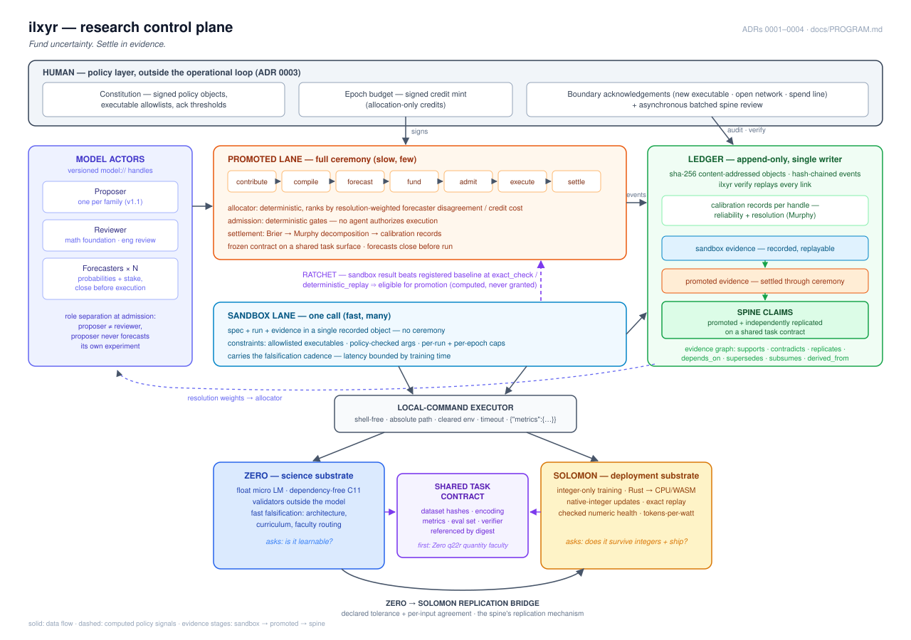
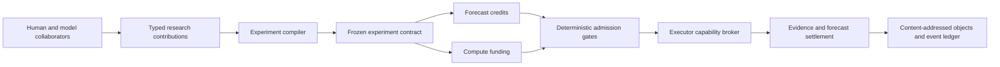

# Architecture

## Purpose

ilxyr is a research control plane, not a notebook service and not a cloud scheduler. Its durable
unit is a change to the state of knowledge, supported by a reproducible experiment and a visible
history of predictions, funding, execution, and evidence.

The v1 architecture deliberately separates the portable protocol from infrastructure adapters.
The target operating mode is autonomous: model actors fill every operational role while the
human authors policy and audits the ledger (`docs/PROGRAM.md`, ADR 0003).



The diagram shows the implemented V1 control plane together with the deferred family-onboarding,
shared-task, replication, and spine joints. The flowchart below isolates the promoted lifecycle.


```mermaid
flowchart LR
    H["Human and model collaborators"] --> C["Typed research contributions"]
    C --> P["Experiment compiler"]
    P --> F["Frozen experiment contract"]
    F --> M["Forecast credits"]
    F --> B["Compute funding"]
    M --> G["Deterministic admission gates"]
    B --> G
    G --> X["Executor capability broker"]
    X --> E["Evidence and forecast settlement"]
    E --> L["Content-addressed objects and event ledger"]
```

## V1 components

### Protocol objects

The `ilxyr-core` crate owns serialization and invariants for contributions, compiled experiments,
forecasts, funding commitments, admission decisions, runs, authority-bearing evidence,
certificates, signed epoch budgets, allocations, settlements, sandbox records, promotion
eligibility, and calibration. JSON Schema files allow other languages and models to produce the
same wire objects.

### Experiment compiler

Compilation resolves the four required research-stage IDs to immutable artifact hashes and freezes
the experiment and outcome contract under a unique experiment ID. Revisions must use a new ID;
forecasts can therefore never silently move to a changed target. Compilation also resolves the
declared evidence provenance to actual lineage artifact references; execution adds the immutable
run artifact before evidence is recorded.

### Admission engine

Admission is a deterministic policy decision, not an agent action. V1 checks:

1. all required research stages were resolved;
2. the outcome contract was frozen;
3. enough distinct forecasters participated;
4. enough forecast credits were staked;
5. enough compute credits were committed;
6. an executor adapter exists;
7. the selected weight and execution policies fit that adapter;
8. proposer and engineering reviewer handles differ;
9. the proposer did not forecast its own experiment; and
10. when the frozen experiment requires external preregistration, a matching receipt binds the
    ledgered package to the required provider and visibility before admission.

Forecast stakes express epistemic commitment. Compute credits reserve scarce execution capacity.
They are intentionally separate ledgers and neither is money in v1.

Distinct model forecasters are keyed by their versioned `model_ref`, not a freely chosen actor
alias. An accepted decision freezes the forecast and funding sets. Rejected decisions may be
reevaluated after new inputs arrive; accepted decisions are idempotent. All credit aggregation is
checked for overflow.

### Signed policy and allocation

The local policy root is an immutable ledger record binding a human owner to an Ed25519 public key.
Epoch budgets are accepted only after strict validation and signature verification over canonical
JSON. A budget freezes executable allowlists, exact argument vectors, network policy, per-run and
per-epoch caps, total credits, directional metric baselines, and acknowledgement thresholds.

The deterministic allocator ranks forecasted candidates by resolution-weighted probability
variance divided by required credits. New handles receive a probationary weight; settled handles
use their recorded resolution. Effectively unanimous candidates receive no allocation. Funding and
the corresponding budget reservation are recorded before admission. `run-auto` executes only an
admitted experiment with a matching allocation and a clean threshold decision. The signed
replication-reserve percentage is unavailable to general/sandbox allocation and is consumed only
by a ledgered replication contract through `replication-allocate`.

### Sandbox lane and ratchet

The sandbox path records an immutable small command/metric/authority plan, checks it against the
signed budget, reserves credits, executes the same local adapter, and records the run and sandbox
evidence in one call. Retries must match the complete frozen plan and reuse its allocation.
Exact-check or deterministic-replay evidence becomes promotion-eligible when at least one promoted
metric satisfies its signed directional baseline rule. Eligibility is a recorded deterministic
result; the promoted ceremony must still follow.

### Evidence, certificates, and calibration

Evidence records `(level, scope, provenance)` plus its sandbox, promoted, or retro lane. Provenance contains
existing lineage or budget artifacts and the completed run reference. Certificates attach
additively to evidence and are accepted only when their declared predicate matches the recorded
metric or execution result, their domain is structurally decidable, and their checked artifacts
exist and include the run. V1 records the checker identity and domain declaration; it does not
invoke an arbitrary external checker or cryptographically attest its execution.

Promoted settlement recomputes each human/model forecaster's multiclass Murphy decomposition from
all settled forecasts and appends a new immutable calibration record when its input set changes.

### Local executor

The reference adapter supports only `local-command` experiments in the public-weight lane. It
requires `code_policy=arbitrary`, `export_policy=artifacts`, an open network declaration, and an
absolute executable. It invokes the executable without a shell, clears inherited environment
variables, applies a wall-clock timeout to the direct child, and caps captured output. Admission
is recomputed immediately before execution. The adapter expects stdout shaped as:

```json
{"metrics":{"metric_name":0.82}}
```

Retro adapters additionally emit `source` with the frozen repository, commit, and artifact
path/SHA-256 list. That attestation must exactly equal the retro plan before evidence is recorded.

The metric keys must exactly equal the frozen experiment metric names; parse errors, missing keys,
and undeclared keys are recorded on the terminal run and cannot become evidence. This adapter
demonstrates the capability boundary; it is not a general-purpose sandbox. It also suffices to
onboard the Zero and Solomon harnesses: both are local binaries that can emit the metrics contract.
Each experiment ID may produce only one completed run. Output that fails frozen outcome resolution
still produces a terminal, inspectable run record, but no evidence or forecast settlement. For a
resolved run, retrying resumes missing evidence and settlements without re-executing the program.
If execution started but no terminal run exists, `run-auto` fails closed; the explicit manual path
is required to decide whether rerunning is safe.

### Attested OCI jobs

The `oci-job` profile is asynchronous and provider-neutral. Compilation freezes exact corpus
release refs and a digest-pinned OCI image. A dispatch binds those releases to verified S3 or Azure
materializations and records the provider job ref. Reconciliation records exact metrics and
versioned artifacts, but does not create evidence. Promotion happens only after a trusted executor
key signs the run digest. This makes submission, completion, attestation, and settlement safe to
resume independently.

### Research ledger

Objects are canonicalized JSON addressed as `artifact://sha256/<digest>`. Events form a SHA-256
chain and point to those objects. `ilxyr verify` re-hashes every object, verifies every link, and
confirms that event artifacts exist. Normal workflow APIs are the only ledger mutation boundary,
and every append verifies the existing chain first. V1 is intentionally single-writer.

### Evidence interoperability

The read-only export boundary verifies the workspace, resolves one `EvidenceRecorded` object and
its protocol context, and emits a native evidence bundle plus standards-oriented views. RO-Crate
1.3 and PROV-O provide discovery/provenance metadata; in-toto Statement v1 provides an unsigned
attestation statement; and the MLflow output is a REST request template that a separate
authenticated adapter may execute. None of these views can admit a run, promote evidence, or alter
the ledger.

The native bundle is lossless and normative for ilxyr semantics. External views preserve native
artifact identifiers and namespaced authority/risk fields. SLSA provenance generation, hardware
remote-attestation verification, OSF API authentication and remote-content verification, network
delivery, and detached-bundle verification remain adapter work. See `docs/INTEROPERABILITY.md`.

### Signed executor attestations

Executor public keys are installed as immutable Ed25519 trust records bound to service actor
identities. The attestation verifier accepts DSSE in-toto JSON envelopes, verifies signatures over
the specification's pre-authentication encoding and exact decoded payload bytes, and only then
parses that same payload. The statement must bind a subject SHA-256 to a ledgered run.

The current SLSA provenance v1 profile additionally requires
`buildDefinition.externalParameters.ilxyrRunRef` to equal the run and
`runDetails.builder.id` to equal the executor identity of a verified key. A smaller native executor
predicate has equivalent run/identity bindings. Accepted envelopes are additive records included
in native and RO-Crate evidence exports. This verifies an external assertion; it does not infer a
SLSA level, prove platform isolation, or establish hardware remote attestation.

### Remote execution reports

The remote reporting boundary is implemented as pure verification before a ledger write. An
environment manifest identifies one reproducible runtime by digest. A job package binds the
compiled experiment, all executable and data bytes, provider shape and image, budget, ordered
targets, allocation policy, network/export policy, and expected executor. A signed report then
binds that package and environment to one authorization, one launch, one canonical run, and SLSA
provenance from the expected executor.

The execution node is responsible for submitting its signed report, but it is not allowed to
publish the report as verified. ADR 0007 separates the future authenticated intake, independent
verifier, single-writer ledger, public projection, and read-only site. The Cenetex public-v1
environment is currently a source-visible reference candidate; no accepted environment manifest
or verified remote result exists yet.

### External preregistration

An experiment may freeze an OSF `public` or `embargoed` registration requirement. The registration
packager materializes the complete compiled experiment in a deterministic content-addressed object
before execution. An authorized human or adapter registers that object externally and submits a
receipt containing the provider registration ID/URL, visibility, public DOI when applicable,
actor, timestamp, and exact package reference.

The recorder rejects a receipt when the experiment has started, the package was not ledgered, the
provider or visibility differs from the frozen requirement, the package contains a different
compiled object, or the external registration identifier is already bound to another experiment.
Admission remains closed until this check passes. V1 does not authenticate to OSF or verify remote
page contents; the receipt actor is accountable for that external assertion.

### Corpus service boundary

The `ilxyr-corpus-service` binary is an authenticated, single-writer HTTP boundary for immutable
corpus releases. A release freezes its source revision, rights, file paths, sizes, media types, and
SHA-256 digests into one content-addressed artifact. Re-registering identical content is
idempotent; changing content under the same corpus ID is rejected.

External materializers copy corpus files to S3 or Azure Blob, read them back, and submit a receipt.
The service accepts a receipt only when its complete file inventory exactly matches the registered
release and every provider object has a version identifier. It then emits provider-specific,
digest-tagged input fragments plus the complete verification inventory for SageMaker or Azure ML.
The executor must hash mounted or downloaded files before training. Uploading bytes, storing cloud
credentials, creating provider resources, and submitting training jobs remain authenticated
adapter work. See `docs/CORPUS-SERVICE.md`.

## Portable core and infrastructure adapters

Future implementations should preserve protocol objects and event semantics while replacing the
following edges:

| Portable responsibility | Adapter examples |
| --- | --- |
| Object store | local filesystem, S3, GCS, Azure Blob, MinIO |
| Event transport | local JSONL, NATS JetStream, Kafka, cloud queues |
| Metadata/query store | PostgreSQL, managed PostgreSQL-compatible services |
| Executor | Kubernetes Jobs, AWS Batch, Vertex AI, Azure ML, Slurm |
| Protected-weight broker | KMS-backed handles, confidential VMs, attested enclaves |
| Identity | OIDC workload identity, SPIFFE/SPIRE, cloud-native federation |
| Cost oracle | cloud price APIs, cluster quota service, internal compute exchange |
| Experiment tracker | MLflow bridge consuming completed evidence bundles |
| Registration archive | OSF receipt bound to the compiled plan digest |
| Research packaging | RO-Crate 1.3 JSON-LD with W3C PROV-O mappings |
| Supply-chain attestations | signed in-toto/DSSE and SLSA provenance from executors |

Cloud adapters must consume a compiled experiment by immutable digest and emit the same run and
evidence objects. Provider concepts must not leak into the experiment protocol.

## Evidence lanes and knowledge state

The execution protocol operates two forward lanes plus retro replay, connected by a deterministic
ratchet (ADR 0003):

- **Sandbox lane** — single-object recording with structural caps; absorbs the
  falsification cadence without ceremony overhead.
- **Promoted lane** — full contribution-forecast-funding ceremony; produces promoted evidence.

A sandbox result that beats a ledger-registered baseline at sufficient authority becomes
eligible for promoted compilation. Eligibility is computed from evidence, never granted.

The knowledge layer records immutable claim nodes and additive edges:

- `supports`
- `contradicts`
- `replicates`
- `depends_on`
- `supersedes` — the old claim is now wrong
- `subsumes` — the old claim remains valid within a declared scope
- `derived_from`

Contradictions coexist; an agent must not rewrite prior evidence or collapse disagreement
into one confidence score. The query interface is passive: it answers "what is the evidence
state of X" — both chains plus the contradiction's own state — never "is X true."
Recommendations over the graph are advisor forecasts, scored like any other (ADR 0004).

Replication contracts target only claims bound to a ledgered shared-task artifact. They bind one
attached reference evidence object, a future replication experiment compiled against that same
task, its eval set, and pre-run capability tolerances and/or agreement threshold. Only a ledgered
contract may use the signed replication reserve. Settlement requires evidence from that exact
experiment after the contract event, evaluates the declared metrics, requires forward forecast
settlement, and records a mechanical independence assessment: no shared provenance artifacts
other than the required task anchor, a distinct checker, and two present, distinct model-lineage
handles.

`claim-status` is a passive one-node query. It reports adjacent competing edges, replication
settlements, shared-task binding, prospective risk, cold replayability, and successful
independent-replication count. `spine_eligible` is derived only when the task binding and all three
north-star evidence conditions hold; it is not a mutable claim flag and is not a truth value.
Graph traversal, weakest-link authority composition across `depends_on`, and demotion challenge
windows remain deferred.
