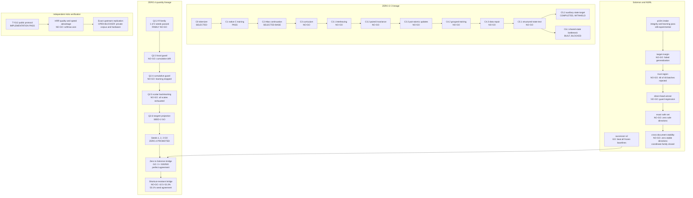

# Research pathways and exploration method

This document maps the decision-bearing model research recorded by ilXyr as of
2026-09-01. It distinguishes a scientific no-go from an unexecuted blocker and
from a completed result whose disclosure is intentionally withheld.

The machine-readable source is [`research-pathways.json`](research-pathways.json).
Its validator requires exact coverage of every experiment in
[`lab-registry.json`](lab-registry.json), every family retro-registration, and
every numbered experiment record from EXP-001 through EXP-008. Supporting
engineering and protocol tests are intentionally outside this scientific map.

## Research coordinates and factor vectors

Every pathway node has three separate version concepts:

| Field | Meaning | Example for C3.1 |
| --- | --- | --- |
| `coordinate.parts` | Exact integer research coordinate | `[3, 1]` |
| `coordinate.slug` | Delimited file and URL form | `c3_1` |
| `record_revision` | Revision of the frozen record | `1` |

The integer array is canonical. A coordinate is never stored as a decimal or
as joined digits. This keeps C3.1 distinct from C31. Existing IDs such as
`zero5-c31-v1` remain unchanged because evidence and hashes already refer to
them. The structured coordinate removes their ambiguity without rewriting
history. New code should derive `c3_1` from `C` and `[3, 1]`; it must not infer
`[3, 1]` by parsing the legacy text `c31`.

Each lineage also declares a fixed factor space. A node's `factor_state` gives
the integer revision of every factor in that space. For the ZERO.5 C lineage,
the axes are checkpoint, tokenizer, data, schedule, representation, objective,
and evaluation. The numbers identify lineage-local states; they are labels,
not quality scores or an ordering of the full experiment. Comparing two node
vectors shows which scientific factors changed and helps planners propose
branches that test different explanations.

Coordinates name nodes, but they do not establish ancestry. The explicit
directed edges remain authoritative for questions such as “superseded by,”
“branched to,” “replicated by,” and “enables.” This matters because C3.1,
C3.2, and C3.3 are a serial chain even though their coordinates look like peer
labels, while C5.1 opens branches at C5.2 and C6.1. Multiple incoming edges can
represent a later merge without forcing that history into one number.

## Status model

Every pathway has five independent status axes:

| Axis | Question |
| --- | --- |
| Execution | Did the declared run complete, or has it not run? |
| Scientific outcome | Did the declared claim resolve positive, negative, mixed, or remain unknown? |
| Disclosure | Is the result public, represented only by a private hash, or withheld? |
| Lifecycle | Is the pathway promoted, selected as a base, experimental, closed, blocked, terminal-private, or open? |
| Evidence | Is the evidence native, retro, external, private, corpus-proxy, or only documented? |

These axes must not be collapsed. In particular:

- A **negative** pathway is completed knowledge and may close a hypothesis.
- A **blocked** pathway has not run and has no scientific result.
- A **withheld** pathway may have completed, but its outcome cannot support a
  public inference.
- A **mixed** pathway contains separately stated positive and negative claims.

The current graph contains 30 nodes: 28 completed and two not run. Eight have
positive scientific outcomes, 17 negative, two mixed, and three unknown. These
counts are not a success rate: the nodes include enabling experiments,
diagnostics, replications, managed checkpoints, and blocked questions at
different levels of the same lineages.

## Pathway map



## Successful pathways

### ZERO.4 replay-tangent projection

This is the strongest example of the exploration method working correctly.
The sequence isolated four increasingly precise hypotheses:

1. Q2.3 showed that locally safe steps can accumulate into an unsafe
   trajectory.
2. Q2.4 showed that cumulative authority preserves safety but can block the
   learning path.
3. Q2.5 showed that scalar step length is not a sufficient intervention.
4. Q2.6 changed update direction without weakening the standard, passed seed
   2, and then reproduced unchanged on seeds 1 and 3.

ZERO.4 is promoted. The next boundary is cross-family replication, not another
repair to this training result.

### Solomon successor-v2

The integer-transformer successor beat uniform, retrieval, byte-ngram, and
float-transformer NLL baselines on 5,896 targets with no zero-probability
windows. The exact pipeline replayed from a clean public checkout. This is a
promoted Solomon result and supplied the deployment substrate used by the
completed Q22 shared-task bridge.

### Zero to Solomon Q22 bridge

The bridge was preregistered before the promotion set opened. Three independently
trained Solomon integer class heads each selected all 500 operations exactly,
and every per-case prediction agreed across seeds. This is a positive transfer
result for the narrow Q22 operation-routing surface. It is not evidence of
arithmetic answer generation, broad language modeling, or general Solomon
promotion; the task can be separated largely through command-prefix features.

Its successor, EXP-008, used this boundary correctly. It removed the prefix
shortcut, balanced wrong-operation distractors, and held out whole template
families while preserving the model and trainer. That successor resolved
no-go, so the EXP-007 claim remains valid but narrow.

### ZERO.5 enabling results

C0 selected the lossless tokenizer, C1 proved stable native-C training, and C2
selected the Atlas checkpoint while improving its earlier anchor. These are
positive enabling results, not a promoted capability claim. C2 remains the
fixed base for the later C experiments.

### Bounded partial successes

The NSRL p10m intake passed integrity and learning but failed overall candidate
eligibility. The public Holo study proved that the implementation executes the
declared protocol but found no quality or speed advantage over softmax. These
are mixed outcomes whose positive and negative claims remain separate.

## Scientifically closed pathways

The following are completed negative results and should not be described as
waiting for more execution:

- Independent local replay budgets as trajectory-level safety.
- A cumulative replay guard as a complete learning policy.
- Scalar learning-rate backtracking under the same candidate direction.
- ZERO.5 curriculum ordering, interleaving, task balancing, paired ordinary
  next-token loss, pair-atomic updates, grouped corpus repair, and further
  fixed-compute data repair as sufficient solutions to the declared gates.
- Structured-state text mixture without a representation that directly
  changes the language decision.
- NSRL hard-negative target-margin training and its disjoint trust-region
  repair.
- The NSRL single direct-head winner, its complete exact safe set, and joint
  moves derived from the same eight document-specific directions.
- A public-corpus T=512 HRR quality or speed advantage over softmax.
- The unchanged 8,192-feature Solomon sparse class head as a solution to
  shortcut-resistant Q22 routing across held-out template families.

A closed result may motivate a new experiment only when the new proposal states
a different causal hypothesis. Relaxing the failed gate or repeating a nearby
parameter choice does not reopen the pathway.

## Blocked, withheld, and experimental pathways

### ZERO5-C5.2 — terminal private

The run completed, but its frozen boundary forbids publishing the outcome or
using it to justify a public follow-up. It is neither a public success nor a
public failure.

### ZERO5-C6.1 — blocked on authorization

The implementation, evaluator, bridge-off ablation, and contract exist. The
run has not started because its exact seed-0 compute requires separate
authorization. If authorized, it should be treated as a representation-level
test, not as another text-mixture repair.

### NSRL p10m — managed experimental

The checkpoint still fails numeric-health, generation, context, serving, and
provenance gates; independent evidence remains unopened. The direct-head
coordinate branch is closed. Provenance repair can proceed independently, and
the next scientific diagnostic should ask whether the frozen representation
contains stable cross-document predictive signal.

### Holo exact replication — externally blocked

The public proxy should not be rerun to search for an advantage. Exact
replication remains open until the original Telegram corpus and matching MPS
conditions are available.

## Reasoner frontier

Reasoner (3,9) is the active scientific frontier. Its external public result
supports active compositional law induction inside a fixed typed integer
program language. It does not establish open-ended reasoning or arbitrary
representation transfer.

Reasoner 4.0 records the next open question: infer a structured adapter from
examples while the (3,9) core remains frozen. It is deliberately marked
`not_run`, `unknown`, `open`, and `documented`. No prospective experiment has
been compiled and no execution is authorized.

## Assessment of the exploration method

The program is excellent at preserving truth. Prospective contracts, immutable
source bindings, exact replay, staged gates, source retention, sealed hidden
data, and family replication repeatedly prevented partial improvements from
becoming false promotion claims.

The weaker part is experiment selection. Several lineages perform serial
nearest-neighbor repair: observe a failure, change the closest schedule, data
mixture, guard, or candidate-selection detail, and run again. This maximizes
auditability per run but not necessarily information gained per run.

Three risks follow:

1. **Local-repair chains.** A sequence can spend multiple runs adjusting one
   intervention family before testing representation, objective, or update
   direction.
2. **Exact low-information experiments.** Determinism can reproduce a
   surface-specific result perfectly; replay is necessary but does not prove
   generality. EXP-007 passed at 100% on every seed, while its shortcut-resistant
   EXP-008 successor fell to 42.5–53.3% and only 53.1% seed agreement.
3. **Promotion gates used as diagnostics.** A failed conjunction protects the
   lifecycle but may not identify the failed mechanism.

The NSRL lineage eventually corrected this by running a read-only
cross-document stability test. The ZERO.4 lineage corrected it when Q2.6
changed update geometry instead of weakening the replay standard. Those moves
should become normal earlier in a lineage.

## Proposed exploration rules

For each major run, freeze competing explanations in four categories:

1. The data does not contain the required signal.
2. The representation does not retain the signal.
3. The objective points in the wrong direction.
4. The optimizer cannot realize a useful direction safely.

The proposed measurements must distinguish at least two of those explanations.
If every possible result merely justifies another nearby parameter adjustment,
the experiment is not discriminating enough.

Apply these additional rules:

- Run cheap cross-document or cross-seed stability audits before local
  optimization.
- After two consecutive failures in one intervention family, require a change
  in abstraction rather than another parameter tweak.
- Keep promotion gates unchanged, but add non-authoritative diagnostic panels
  that identify the failed mechanism.
- Track lineage-level experiment count, compute, and public-evaluation exposure
  in addition to per-run budgets.
- Require forecasts for major scientific branches, including ZERO.5 and NSRL,
  while leaving small implementation checks outside that ceremony.
- Record `rules_out`, `supports`, `supersedes`, and `next_allowed` edges as
  first-class graph data.

## Priority order

1. Write and review the Reasoner 4.0 representation-transfer contract without
   authorizing execution.
2. Run a read-only representation-sufficiency diagnosis of EXP-008 before
   choosing a representation- or objective-level successor on fresh templates.
3. Run a read-only NSRL frozen-representation sufficiency audit before another
   training method.
4. Import the remaining external evidence and settle the verified upstream
   family evidence locally.
5. Do not reopen the closed local-coordinate, scalar-backtracking, ordinary
   paired-next-token, or public-proxy HRR-advantage branches without a new
   causal hypothesis.

## Maintenance

Run:

```bash
npm run test:registry
```

The pathway validator fails when a lab-registry experiment, family
retro-registration, or numbered EXP record is added without a corresponding
pathway node. It also rejects missing or decimal coordinates, delimiter-free
coordinate slugs, duplicate coordinates, incomplete factor vectors, invalid
record revisions, same-lineage edges that change no factor, missing source
files, dangling or cyclic edges, inconsistent outcome axes, leaked
terminal-private status, and promoted nodes that are not completed positive
results.
